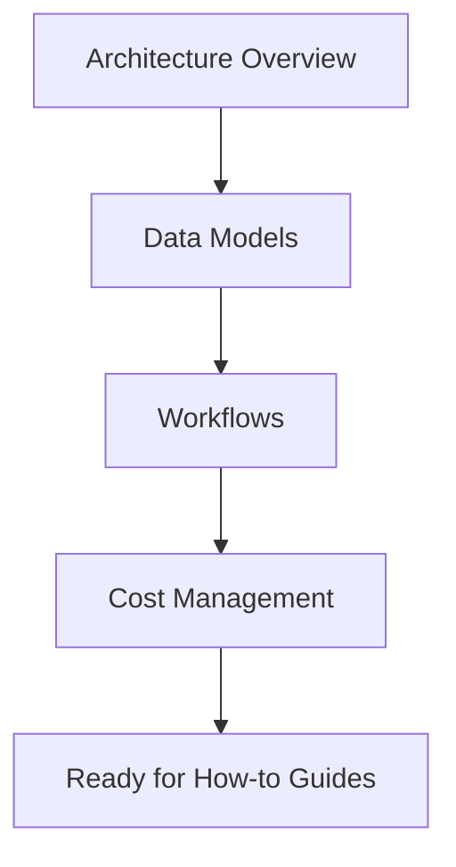

# Concepts

Learn the core concepts behind VibeML's architecture and operation.

## Overview

This section covers fundamental concepts you need to understand to use VibeML effectively:

- **[Architecture](architecture.md)** - System design and component interaction
- **[Data Models](models.md)** - TrainingRequest, JobHandle, and other core models
- **[Workflows](workflows.md)** - Unsloth, LoRA, and custom training workflows
- **[Cost Management](cost-management.md)** - Budget tracking and cost optimization

## Key Concepts

### Conversational Interface

VibeML bridges the gap between natural language and cloud infrastructure:

```
"Train Llama-3.2-1B on Alpaca with a $15 budget"
    ↓
TrainingRequest validation
    ↓
Cost estimation & GPU selection
    ↓
Script generation
    ↓
Cloud deployment
```

### Multi-Cloud Abstraction

VibeML uses SkyPilot to abstract cloud providers:

- Write once, deploy anywhere (AWS, GCP, Azure, Nebius)
- Automatic region and GPU selection
- Cost-optimized resource allocation
- Unified monitoring and management

### Safety-First Design

Every operation includes validation and safety checks:

1. **Model/Dataset Validation** - Verify accessibility on HuggingFace Hub
2. **Resource Validation** - Ensure GPU has sufficient memory
3. **Cost Validation** - Check against budget limits
4. **Error Recovery** - Automatic retries with exponential backoff
5. **Budget Tracking** - Real-time spending monitoring

## Learning Path



Start with [Architecture](architecture.md) to understand the system design.
