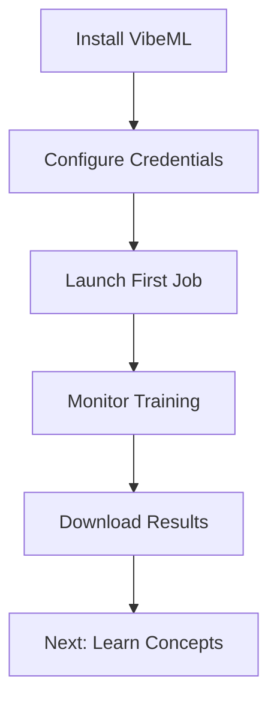

# Get Started

Welcome to VibeML! This section will help you get up and running with AI model training on cloud GPUs in minutes.

## What You'll Learn

1. **[Installation](installation.md)** - Install VibeML and its dependencies
2. **[Quick Start](quickstart.md)** - Launch your first training job
3. **[Configuration](configuration.md)** - Set up cloud credentials and preferences

## Prerequisites

Before you begin, ensure you have:

- **Python 3.10 or higher** installed
- **UV package manager** (recommended) or pip
- **Cloud provider account** (Nebius, AWS, GCP, or Azure)
- **HuggingFace account** (for accessing models and datasets)

## Learning Path

## Time Estimate

- **Installation**: 5 minutes
- **Configuration**: 10 minutes
- **First training job**: 2 minutes to launch, 1-4 hours to complete

## Getting Help

If you encounter issues:

1. Check the [Troubleshooting Guide](../playbooks/troubleshooting.md)
2. Review [Common Errors](../playbooks/common-errors.md)
3. [Open an issue](https://github.com/prassanna-ravishankar/vibeml/issues) on GitHub

Ready? Let's [install VibeML](installation.md)!
