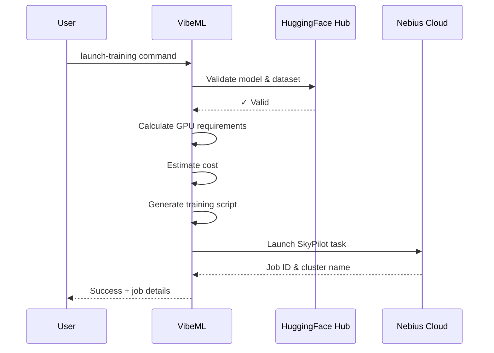

# Quick Start

Launch your first training job in under 5 minutes.

## Prerequisites

- VibeML installed ([installation guide](installation.md))
- Cloud provider credentials configured ([configuration guide](configuration.md))

## Your First Training Job

Let's train a small Llama model on the Alpaca dataset using Nebius Cloud:

```bash
vibeml launch-training \
  --model meta-llama/Llama-3.2-1B \
  --dataset tatsu-lab/alpaca \
  --workflow unsloth \
  --gpu-type L40S \
  --max-cost 15.0
```

### What This Does

1. **Validates** the model and dataset exist on HuggingFace Hub
2. **Calculates** GPU memory requirements (L40S has 48GB, perfect for 1B model)
3. **Estimates** cost (~$12-15 for 10-13 hours on L40S spot instances)
4. **Generates** a training script using the Unsloth template
5. **Launches** the job on Nebius Cloud
6. **Returns** a job handle for monitoring

### Expected Output

```json
{
  "status": "success",
  "cluster": "vibeml-llama-3-2-1b-20251026",
  "job_id": "vibeml-llama-3-2-1b-20251026",
  "cost_estimate": {
    "hourly_rate": 1.008,
    "estimated_duration_hours": 12.5,
    "expected_cost": 12.6,
    "min_cost": 10.08,
    "max_cost": 16.38
  },
  "gpu_type": "L40S",
  "cloud": "nebius",
  "workflow": "unsloth"
}
```

## Monitor Your Job

Check the status of your training job:

```bash
vibeml get-job-status --cluster vibeml-llama-3-2-1b-20251026
```

List all active jobs:

```bash
vibeml list-jobs
```

## Download Results

Once training completes, download your fine-tuned model:

```bash
# SSH into the cluster
sky ssh vibeml-llama-3-2-1b-20251026

# Download outputs
scp -r vibeml-llama-3-2-1b-20251026:~/outputs ./my-model
```

Or use SkyPilot's storage:

```bash
sky storage download gs://my-bucket/outputs ./my-model
```

## Using MCP (Claude Code)

If you're using Claude Code or another MCP-enabled assistant, just ask in natural language:

```
"Train Llama-3.2-1B on the Alpaca dataset using Nebius L40S GPUs with a $15 budget"
```

The assistant will:
1. Call `launch_training` via the MCP server
2. Show you the cost estimate
3. Launch the job with your approval
4. Provide the job ID for monitoring

## Common Workflows

### Budget-Conscious Training

Use spot instances with a strict budget:

```bash
vibeml launch-training \
  --model meta-llama/Llama-3.2-3B \
  --dataset my-org/my-dataset \
  --max-cost 20.0 \
  --use-spot true
```

### Production Training

Use on-demand instances for reliability:

```bash
vibeml launch-training \
  --model meta-llama/Llama-3.2-7B \
  --dataset production-data \
  --gpu-type H100 \
  --use-spot false \
  --max-steps 5000
```

### Custom Hyperparameters

Override default training parameters:

```bash
vibeml launch-training \
  --model mistralai/Mistral-7B-v0.1 \
  --dataset tatsu-lab/alpaca \
  --max-steps 1000 \
  --learning-rate 3e-4 \
  --lora-r 32
```

## Understanding the Workflow



## Next Steps

- **[Learn about data models](../concepts/models.md)** - Understand TrainingRequest and JobHandle
- **[Explore workflows](../concepts/workflows.md)** - Unsloth, LoRA, and custom templates
- **[Manage budgets](../how-to/track-budgets.md)** - Set up cost tracking and alerts
- **[Debug issues](../how-to/debug-cloud.md)** - Troubleshoot common problems

## Troubleshooting

### Job Launch Fails

!!! error "No GPU resources available"
    The requested GPU type is not available in the selected region.

**Solution**: Try a different GPU type or region:

```bash
vibeml launch-training ... --gpu-type A100 --cloud nebius
```

### Budget Exceeded

!!! error "Estimated cost exceeds max_cost"
    The estimated training cost is higher than your budget limit.

**Solution**: Use a smaller GPU or enable spot instances:

```bash
vibeml launch-training ... --gpu-type RTX4090 --use-spot true
```

### Authentication Error

!!! error "Cloud credentials not configured"
    Your cloud provider credentials are missing or invalid.

**Solution**: Configure credentials following the [configuration guide](configuration.md).

For more troubleshooting, see the [playbooks section](../playbooks/troubleshooting.md).
