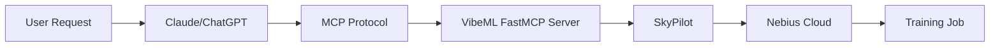

# VibeML

**Conversational AI model training on multi-cloud GPU resources**

VibeML democratizes AI model training by providing natural language access to multi-cloud GPU resources through MCP (Model Context Protocol) and SkyPilot.

---

## Features

- **Conversational Interface**: Launch training jobs using natural language through Claude or ChatGPT
- **Multi-Cloud Support**: Seamlessly deploy across AWS, GCP, Azure, and Nebius Cloud
- **Cost Optimization**: Automatic GPU selection, spot instance management, and budget tracking
- **Pre-configured Workflows**: Unsloth, LoRA, and full fine-tuning templates ready to use
- **MCP Integration**: First-class support for Model Context Protocol
- **Production Ready**: Comprehensive error handling, validation, and monitoring

## Quick Start

=== "CLI"

    ```bash
    # Install VibeML
    uv tool install vibeml

    # Launch your first training job
    vibeml launch-training \
      --model meta-llama/Llama-3.2-1B \
      --dataset tatsu-lab/alpaca \
      --workflow unsloth \
      --gpu-type L40S \
      --max-cost 10.0
    ```

=== "MCP Server"

    ```python
    # In your MCP-enabled AI assistant (Claude, ChatGPT)
    "Launch training for Llama-3.2-1B on the alpaca dataset using Nebius L40S GPUs with a $10 budget"
    ```

=== "Python API"

    ```python
    from vibeml import launch_training

    result = await launch_training(
        model="meta-llama/Llama-3.2-1B",
        dataset="tatsu-lab/alpaca",
        workflow="unsloth",
        gpu_type="L40S",
        max_cost=10.0
    )
    print(f"Job launched: {result['cluster']}")
    ```

## Architecture



VibeML acts as a bridge between conversational AI assistants and cloud GPU infrastructure, handling:

- **Parameter Validation**: Model and dataset compatibility checking via HuggingFace Hub
- **Resource Optimization**: Intelligent GPU selection based on model size and cost constraints
- **Cost Management**: Budget enforcement, spending tracking, and cost estimation
- **Script Generation**: Automatic training script creation from templates
- **Job Orchestration**: SkyPilot-based multi-cloud deployment
- **Error Recovery**: Comprehensive exception handling with retry logic

## Next Steps

<div class="grid cards" markdown>

-   :material-rocket-launch: **[Get Started](get-started/installation.md)**

    ---

    Install VibeML and configure your first cloud provider

-   :material-book-open-variant: **[Learn Concepts](concepts/architecture.md)**

    ---

    Understand VibeML's architecture and data models

-   :material-file-document: **[How-to Guides](how-to/launch-jobs.md)**

    ---

    Step-by-step guides for common tasks

-   :material-api: **[API Reference](reference/cli.md)**

    ---

    Complete CLI and Python API documentation

</div>

## Why VibeML?

Traditional ML training requires:

1. Manual cloud provider setup and authentication
2. Writing and debugging training scripts
3. GPU instance selection and cost calculation
4. Resource provisioning and job monitoring
5. Error handling and retry logic

**VibeML eliminates this complexity:**

```
You: "Train Llama-3.2-1B on my custom dataset with a $20 budget"
VibeML: ✓ Validates model and dataset
        ✓ Selects optimal GPU (L40S)
        ✓ Estimates cost ($15.60 for 13 hours)
        ✓ Generates training script
        ✓ Launches job on Nebius Cloud
        ✓ Provides monitoring dashboard
```

## Community

- **GitHub**: [prassanna-ravishankar/vibeml](https://github.com/prassanna-ravishankar/vibeml)
- **Issues**: [Report bugs or request features](https://github.com/prassanna-ravishankar/vibeml/issues)
- **Contributing**: See our [contribution guide](contributing.md)

## License

VibeML is licensed under the [MIT License](license.md).
