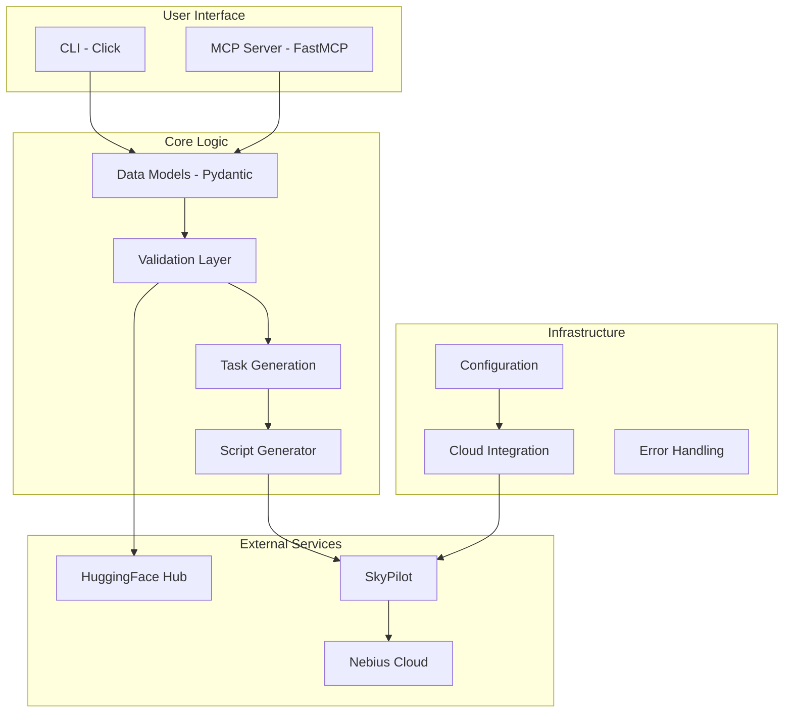

# Internals

Documentation for contributors and developers working on VibeML.

## Contents

- **[Development](development.md)** - Setting up a development environment
- **[Testing](testing.md)** - Running and writing tests
- **[Deployment](deployment.md)** - Deployment and release processes

## Development Workflow

1. **Setup** - Clone repo, install dependencies with UV
2. **Develop** - Make changes following CLAUDE.md guidelines
3. **Test** - Run pytest, mypy, and ruff checks
4. **Document** - Update docs and docstrings
5. **Submit** - Create PR with clear description

## Architecture Overview



## Module Organization

```
src/vibeml/
├── __init__.py           # Package exports
├── __main__.py           # CLI entry point
├── server.py             # MCP server
├── tasks.py              # SkyPilot task generation
├── exceptions.py         # Custom exceptions
├── models.py             # Pydantic data models
├── cloud/                # Cloud integration
│   ├── __init__.py
│   └── cost_estimator.py
├── config/               # Configuration management
│   ├── __init__.py
│   ├── credentials.py
│   ├── preferences.py
│   └── budget.py
├── validation/           # Validation layer
│   ├── __init__.py
│   ├── model_validator.py
│   ├── dataset_validator.py
│   └── resource_validator.py
└── scripts/              # Script generation
    ├── __init__.py
    └── generator.py
```

## Testing Strategy

- **Unit Tests** - Individual components in isolation
- **Integration Tests** - Component interactions
- **E2E Tests** - Full workflow simulation (mocked cloud)
- **Type Checks** - mypy strict mode
- **Linting** - ruff with comprehensive rules

## Code Quality

We maintain high code quality through:

- Type hints on all public APIs
- Google-style docstrings
- Pydantic validation
- Comprehensive error handling
- 100% test coverage for core modules

## Contributing

See [Contributing Guide](../contributing.md) for:

- Code style guidelines
- PR process
- Commit message format
- Testing requirements
- Documentation standards

## Release Process

1. Update version in `pyproject.toml`
2. Update CHANGELOG
3. Create release PR
4. Tag release after merge
5. GitHub Actions publishes to PyPI

## Development Commands

```bash
# Install dev dependencies
uv sync --group dev

# Run tests
nox -s tests

# Run type checking
nox -s mypy

# Run linting
nox -s pre-commit

# Build docs locally
mkdocs serve

# Run specific test
nox -s tests -- tests/test_models.py

# Generate coverage report
nox -s coverage
```

## Debugging

### Local Development

```bash
# Install in editable mode
uv pip install -e .

# Run with debug logging
VIBEML_LOG_LEVEL=DEBUG vibeml launch-training ...

# Use pdb for debugging
python -m pdb -m vibeml launch-training ...
```

### MCP Server Debugging

```bash
# Run MCP server in debug mode
vibeml --mcp --debug

# Test MCP calls
echo '{"method": "launch_training", "params": {...}}' | vibeml --mcp
```

## Performance Considerations

- **Async Operations** - All cloud operations are async
- **Connection Pooling** - Reuse HTTP connections
- **Caching** - Cache HuggingFace Hub lookups
- **Lazy Loading** - Import heavy dependencies only when needed

## Security

- Fernet encryption for credentials
- No plaintext secrets in logs
- Secure file permissions (0600)
- Input validation on all user data
- Dependency vulnerability scanning
